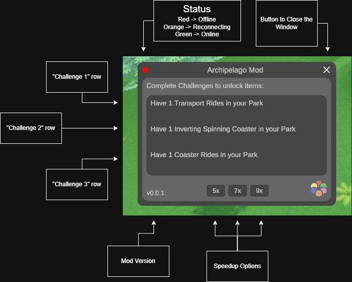

# 🎡 Archipelago Parkitect

Welcome to the **Archipelago Parkitect Mod**!  
This mod connects **Parkitect** to the **Archipelago** multiworld randomizer — allowing for a unique and interconnected experience across multiple games.  

It’s also a **randomizer** in its own right! 🌀

---

## 📦 Installation

1. **Download the Mod Files**
   - You can find the latest release [here](https://github.com/CrusherRL/AP_Parkitect/releases).

2. **Extract the Files**
   - Place the extracted folder into your Parkitect `Mods` directory.  
     Example path:  
     ```
     ...\Documents\Parkitect\Mods\Archipelago
     ```

3. **Enable the Mod**
   - Launch Parkitect.
   - Go to **Main Menu → Mods**.
   - Enable **Archipelago**.

4. **Download/Activate the Campaign**
   - You can find it [here](https://mod.io/g/parkitect/m/archipelago-parks#description)

5. **Configure your Config**
   - If the mod can’t find the config file, it will automatically create one.
   - If you don’t see the folder yet, start Parkitect once with the mod enabled — it will generate the config automatically.
   - Anyway you can find it there:
    ```
    ...\AppData\LocalLow\Texel Raptor\Parkitect\Parkitect_Archipelago\config_parkitect.json
    ```
    ```json
    {
        "Address": "localhost",
        "Port": 38281,
        "Playername": "CrusherParkitect",
        "Password": ""
    }
    ```
    - Once configured you should restart your Park. Preferably you should quit the current park and re-enter it. In this way all Mods are reloading.

6. **Connect to Archipelago**
   - This mod does not need an extra Client to connect to the Archipelago Server

---

## 🖥️ Archipelago UI Overview
Shortcut to toggle this Window is **Z**



### Debugger Window
If something doesn’t work as expected, press F12 to open the Debugger Window for detailed logs and troubleshooting.

---

## 🔀 What Can the Randomizer Change?

### 🎢 Player
- Adjust **Ride Speed** (adds new options: `5x`, `7x`, `9x`)
- Add **Money**

### 🧍 Guests
- Spawn guests
- Modify their money
- Kill (remove) them
- Change their needs (hungry, thirsty, happy, tired, bathroom)
- Cause **vomiting** or **nausea**
- Turn them into **vandals**

### 🧑‍🔧 Employees
- Hire automatically
- Set **tired** state
- Send for **training**

### ☁️ Weather
- Set to **Rainy**, **Cloudy**, **Sunny**, or **Stormy**

### 🎠 Attractions
- Trigger **breakdowns**
- Enable **vouchers**

### 🍔 Stalls / Shops
- Re-deliver ingredients
- Set **cleaning tasks**
- Apply **vouchers**

### 🗺️ Scenario
- Add any **goal** with any **reward**

---

## 🎯 Challenge Requirements

### 🎡 Attraction Challenge
To complete:
- Must be **open**
- Stats must **not be outdated**
- Must have had **at least one customer**

### 🍟 Shop Challenge
To complete:
- Must be **open**
- Must have had **at least one customer**

---

## ⚠️ Known Bugs & Errors

| Issue | Description | Workaround |
|--------|--------------|-------------|
| Goal Achievement | Sometimes Archipelago or the mod might fail to send all items. | Open the Debugger Window and trigger the completion manually. |
| Manual Goal Completion | Manually finishing the park or editing the data file won’t trigger goal completion. | Use the Debugger workaround above. |
| Possible Game Crashes | In rare cases, the game may crash. | Please report this on GitHub and attach both `debug.log` and `Player.log` (found in `...\AppData\LocalLow\Texel Raptor\Parkitect\`). |

---

## 🧪 Testing & Compatibility

| Category | Status | Notes |
|-----------|---------|-------|
| **Operating Systems** | ✅ Tested on **Windows 10** | Not tested on **Linux** or **macOS** yet |
| **Multiplayer** | ⚠️ Not Tested / Likely Unsupported | The mod was designed for single-player mode — multiplayer may cause sync issues |
| **Game Version** | ✅ Latest Steam release (1.12b2) | Earlier versions won’t work |
| **Other Mods** | ⚙️ Tested with **Perspective Camera** | No major conflicts observed |
| **Performance** | ✅ Stable | No major FPS drops or memory issues during extended play |
| **Archipelago Connection** | ✅ Tested with local and remote servers | No known connection issues |
| **Archipelago Multigame** | ⚠️ Not Tested | will Test is, should work xD |

> 💡 If you test the mod on other systems or with different mods, please share your results via GitHub or Discord to help expand this table!

---

> If you find new issues, please report them (see below).

---

## 🧾 Reporting Bugs & Feedback

If you encounter issues or have suggestions:

1. Open a new issue on [GitHub](https://github.com/CrusherRL/AP_Parkitect_World/issues)
2. Include:
   - A short **description** of the problem  
   - Your **log file** (found under `Mods/Archipelago/debug.log.text`)  
   - Any **screenshots** if relevant
   - (Optional) The SlotData file
3. Tag it appropriately:
   - `bug` for errors or crashes  
   - `enhancement` for ideas or improvements  

---

## 🚫 Things You Shouldn’t Do

- Don’t try to **run multiple Archipelago connections** at once.
- Don’t **rename** or move internal mod files.
- Don’t **edit save data manually** — it may break synchronization.
- Don’t **overwrite slotdata files** from other worlds.

---

## 🧭 Scenario Rules

> 💡 You can **request maps** if you’d like to contribute!

To be accepted, a scenario **must**:
- Include **all attractions and shops**
  - Decorations are optional, they will not be randomized
- Have **1 mandatory goal** (usually 100% Happiness)
- Allow **guests to enter** the park without issues
- Be **fun and engaging** (no empty maps 😅)
- Be **possible** but not overly difficult
- Enough **Space** to build alot of stuff 
- The Park **must** work in vanilla

---

## 🏗️ Submitting New Parks

Want your park to be part of the Archipelago experience?

To submit a park:
1. Follow the **Scenario Rules** above.
2. Export your scenario and send it via:
   - GitHub Pull Request, or
   - [Discord](https://discord.com/channels/731205301247803413/1417531615956963439)

---

## 💡 Future Ideas

- add a dedicated **Archipelashop** building:
  - receives items at the **Depot**, delivered by **Handyman**
  - unlocks new features when deliveries are complete
- add more diverse **Scenarios**
- improve **Scenario Design**
- add **Skips** to help the player (as individual items)
- improve **Shop Ingredient Trap**
- enhance the **UI Window** (fade animations)
- add input fields or a dedicated input window
- support **Archipelago hints**

---

## 🌍 Related Projects

- [AP_Parkitect_World](https://github.com/CrusherRL/AP_Parkitect_World)

---

🧩 Have fun building and randomizing!  
Every park tells a story — yours just happens to be shared across worlds.

---

## ❤️ Credits

Created by **CrusherRL**
Special thanks to my friends who helped me with ideas, debugging and adding content!
Special thanks to the **Archipelago Community** for testing, feedback, and support!
