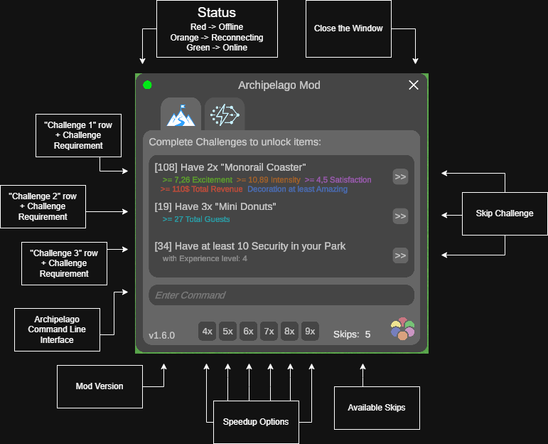
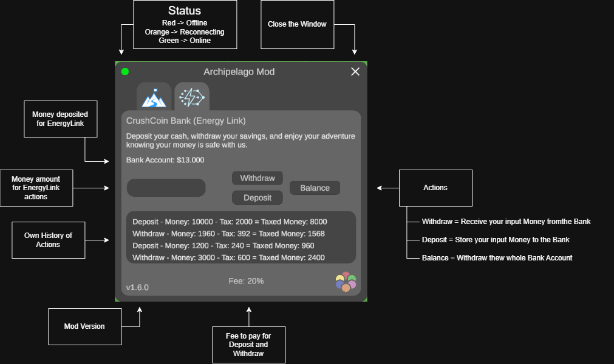

# 🎡 Archipelago Parkitect

Welcome to the **Archipelago Parkitect Mod**!  
This mod connects **Parkitect** to the **Archipelago** multiworld randomizer — allowing for a unique and interconnected experience across multiple games.  

It’s also a **randomizer** in its own right! 🌀

---

## 📦 Installation
It is available on [Steam!](https://steamcommunity.com/sharedfiles/filedetails/?id=3628076737) and [mod.io!](https://mod.io/g/parkitect/m/archipelago-mod#description)
If you decide to Install via Steam, you can skip the first two points.

1. **Download the Mod Files**
    - You can find the latest release [here](https://github.com/CrusherRL/AP_Parkitect/releases).

2. **Extract the Files**
    - Place the extracted folder into your Parkitect `Mods` directory.  
      Windows:  
      ```
      ...\Documents\Parkitect\Mods\Archipelago
      ```
      MacOs:  
      ```
      ~/Library/Application Support/Parkitect/Mods/Archipelago
      ```
      Linux:  
      ```
      /home/[username]/.local/share/Steam/steamapps/common/Parkitect/Mods
      ```

3. **Download the Campaign** (preferably manually, mod.io or steam are weird sometimes)
    - Manually: Place the **Archipelago.campaign** file into `\Documents\Parkitect\Saves\Campaigns`
    - [mod.io here](https://mod.io/g/parkitect/m/archipelago-parks#description)
    - [Steam here](https://steamcommunity.com/sharedfiles/filedetails/?id=3628080525)

4. **Enable the Mod**
    - Launch Parkitect.
    - Go to **Main Menu → Mods**.
    - Enable **Archipelago**.

5. **Configure your AP Connection**
    In Mod Menu, open `Settings` and configure your Archipelago connection. Don't forget to save your changes.
    Once configured, the mod will automatically reconnect if it is currently disconnected.

6. **Start the Game** and enter corresponding Park
    - On Main Menu click on Campaign
      - If Custom Campaign Scenario: Top left (Campaign Maps) -> Community Campaigns -> "Archipelago Parks"
      - If Taste of Adventure Scenario: Top left (Campaign Maps) -> Taste of Adventure

7. **Connect to Archipelago**
    - This mod does not need an extra Client to connect to the Archipelago Server

> **Hint:** You need to finish the Base Game to unlock all Scenarios, except for Custom Campaign Scenario.
> You can also use the **Mod Menu** to unlock all Scenarios at once. This won’t affect your current Campaign—it will automatically create a backup first.

---

## 🖥️ Archipelago UI Overview
Shortcut to toggle this Window is **Z**




### Debugger Window
Helper Window if something seems off. Shortcut is **F12**

---

## 🔀 What Can the Randomizer Change?

### 🎢 Player
- Adjust **Game Speed** (adds new options: `4x`, `5x`, `6x`, `7x`, `8x`, `9x`)
- Add/Remove **Money**

### 🧍 Guests
- Spawn guests
- Modify their money (+/-)
- Kill (remove) them
- Change their needs (hungry, thirsty, happy, tired, bathroom)
- Cause **vomiting**/**nausea**
- Turn them into **vandals**

### 🧑‍🔧 Employees
- Hire automatically
- Set **tired** state
- Send for **training**

### ☁️ Weather
- Set to **Rainy**, **Cloudy**, **Sunny** or **Stormy**

### 🎠 Attractions
- Trigger **breakdowns**
- Apply **vouchers**

### 🍔 Stalls / Shops
- Re-deliver ingredients
- Set **cleaning tasks**
- Apply **vouchers**

### 🗺️ Research
- Put **Attraction**, **Shop** and **Decoration** into the research pool.

### 🗺️ Scenario
- Add any **goal** with any **reward**

---

## 🎯 Goals
Win by completing the park/scenario goals — or by finishing all challenges/checks.

### Parkitect Goals
You can configure multiple win conditions for your scenario. Each goal can be adjusted individually:

#### 👥 Guest Goal
Defines how many guests must be in your park to win.  
- **Range:** 200 – 2.500  
- **Default:** 1.000  

#### 💰 Money Goal
Requires reaching a certain amount of money.  
- **Range:** 50.000 – 500.000  
- **Default:** 100.000  

#### 🎢 Roller Coaster Goal
Number of roller coasters required.  
- **Range:** 0 – 12  
- **Default:** 4  

#### 😀 Excitement Rating
Minimum excitement required for a coaster to count.  
Set to **0** to disable this requirement.  
- **Range:** 0 – 80  
- **Default:** 50  

#### 😬 Intensity Rating
Minimum intensity required for a coaster to count.  
Set to **0** to disable this requirement.  
- **Range:** 0 – 80  
- **Default:** 50  

#### 📈 Ride Profit Goal
Total profit required from all rides.  
- **Range:** 0 – 10.000  
- **Default:** 1.500  

#### 🎟️ Park Tickets Goal
Number of park tickets that must be sold.  
- **Range:** 0 – 20.000  
- **Default:** 0  

#### 🏪 Shops Goal
Number of shops required in the park.  
- **Range:** 0 – 100  
- **Default:** 30  

#### 💵 Shop Profit Goal
Total profit required from shops.  
- **Range:** 0 – 3.000  
- **Default:** 500  

---

## 🎯 Challenge/Check Requirements

### 🎡 Attraction Challenge/Check
To complete:
- Must be **open**
- Stats must **not be outdated**
- Must have had **at least one customer**
- + different requirements from APWorld

### 🍟 Shop Challenge/Check
To complete:
- Must be **open**
- Must have had **at least one customer**
- + different requirements from APWorld

### 🍟 Pay Money Challenge/Check (Optional)
To complete:
- Must **have** X amount of Money

### 🍟 Park Guests Challenge/Check (Optional)
To complete:
- Must **have** X Guests

### 🍟 Employees Challenge/Check (Optional)
To complete:
- Must **have** X Employees
- + different requirements from APWorld

---

## 🧪 Testing & Compatibility

| Category | Status | Notes |
|-----------|---------|-------|
| **Operating Systems** | ✅ Tested on **Windows 10** and **MacOS Sequoia 15.6** and **Linux** ||
| **Multiplayer** | ⚠️ Not Tested / Likely Unsupported | The mod was designed for single-player mode — multiplayer may cause sync issues |
| **Game Version** | ✅ Steam release (1.12f2) | Earlier versions before Steam release (1.12b2) won’t work |
| **Other Mods** | ⚙️ Attraction/Shop Mods are Supported ([Steam Collection](https://steamcommunity.com/sharedfiles/filedetails/?id=3647109901)) ||
| **Performance** | ✅ Stable | No major FPS drops or memory issues during extended play |
| **Archipelago Connection** | ✅ Tested with local and remote servers | No known connection issues |
| **Archipelago Multigame** | ✅ Stable ||

> If you find new issues, please report them (see below).

---

## 🧾 Reporting Bugs & Feedback

If you encounter issues or have suggestions:

1. Open a new issue on [GitHub](https://github.com/CrusherRL/AP_Parkitect_World/issues)
2. Include:
   - A short **description** of the problem  
   - Your **log file** (found under `Mods/Archipelago/debug.log.text`)  
   - Any **screenshots** if relevant
   - (Optional) The SlotData file
3. Tag it appropriately:
   - `bug` for errors or crashes  
   - `enhancement` for ideas or improvements  

---

## 🚫 Things You Shouldn’t Do

- Don’t try to **run multiple Archipelago connections** at once.
- Don’t **rename** or move internal mod files.
- Don’t **edit save data manually** — it may break synchronization.
- Don’t **overwrite slotdata files** from other worlds.
- Don’t **rename** Your Park.

---

## 🧭 Scenario Rules (for Contributors)

> 💡 You can **request maps** if you’d like to contribute!

To be accepted, a scenario **must**:
- Include **all attractions, shops, decorations and statistics**
  - except **Mod Items**
- Have **1 mandatory goal** (something like "Have 95% Happiness")
- Allow **guests to enter** the park without path issues
- Be **fun and engaging** (no empty maps 😅)
- Be **possible** but not overly difficult
- Enough **Space** to build a lot of stuff 
- The Park **must** work in vanilla

---

## 🏗️ Submitting New Parks

Want your park to be part of the Archipelago experience?

To submit a park:
1. Follow the **Scenario Rules** above.
2. Export your scenario and send it via:
   - GitHub Pull Request, or
   - [Discord](https://discord.com/channels/731205301247803413/1417531615956963439)

---

## 💡 Future Ideas

- add a dedicated **Archipelashop** building:
  - receives items at the **Depot**, delivered by **Handyman**
  - unlocks new features when deliveries are complete
- add more diverse **Scenarios**
- improve **Scenario Design**
- improve **Shop Ingredient Trap**
- enhance the **UI Window** (fade animations)

---

## 🌍 Related Projects

- [AP_Parkitect_World](https://github.com/CrusherRL/AP_Parkitect_World)

---

🧩 Have fun building and randomizing!  
Every park tells a story — yours just happens to be shared across worlds.

---

## ❤️ Credits

Created by **CrusherRL**
Special thanks to my friends who helped me with ideas, debugging and adding content!
Special thanks to the **Archipelago Community** for testing, feedback and support!
