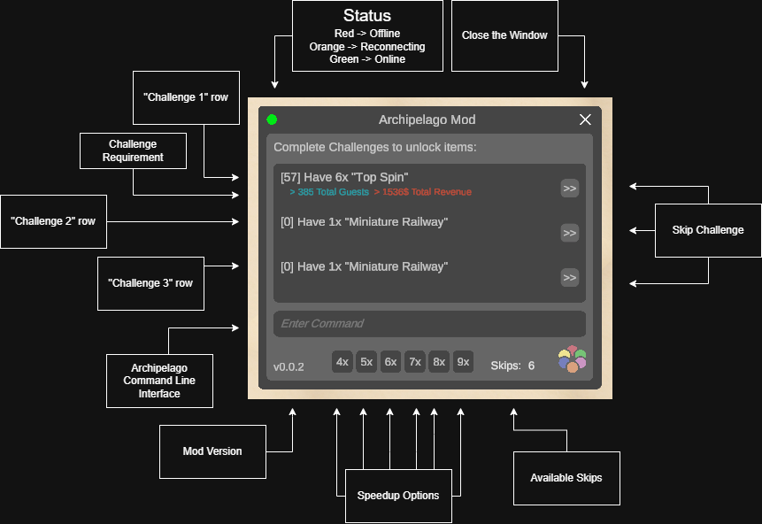

# Archipelago Parkitect 

This tool should help Parkitect to connect with Archipelago.
And is also a randomizer :)

## AP World :)
[AP_Parkitect_World](https://github.com/CrusherRL/AP_Parkitect_World)

## What can the randomizer change?
- Player:
    - Raise Speed (added 5x, 7x and 9x)
    - Add Money

- Guests:
    - Spawn
    - Change their Money
    - Kill them
    - Set them Hungry, Thirsty, Happy and Tired or even send them to the Bathroom
    - Let them Vomit/Nausea
    - Set as Vandals

- Employees:
    - Hiring any
    - Set them Tired
    - Send them to Training
 
- Weather
    - Set Rainy
    - Set Cloudy
    - Set Sunny
    - Set Stormy

- Attractions:
    - Break down
    - Vouchers

- Stalls/Shops:
    - Re-delievery Ingredients
    - Set Cleaning Job
    - Vouchers

- Scenario:
    - Add any Goal with any reward

## Scenario Rules (You can request Maps!)
- Scenario *must* have all Attractions and Shops!
- Define 1 Mandatory Goal (I usually take 100% Happiness)
- Guests *must* enter the Park without issues
- No boring map xD
- Should be possible, not too tricky

## Challenge
To complete an Attraction challenge we must have the follow requirements:
- Must be open
- Stats not be outdated
- Had 1 Customer

To complete a Shop challenge we must have the follow requirements:
- Must be open
- Had 1 Customer

## Open Tasks
- Create a Shop/Stall for Archipelago items
    - Received Items will be placed at the Depot and will be delievered by a Handyman
    - Delievered Items will unlock the Item
    - Name the Stall "Archipelashop"
    - Build the Shop in Unity and creates Textures (Unity 2020.3.37f1)
    - "Ingredient" Boxes should have the Archipelago Logo

- Scenario's
    - Currently only have 1 - Want more :)
    - Probably better Scenario design xD
